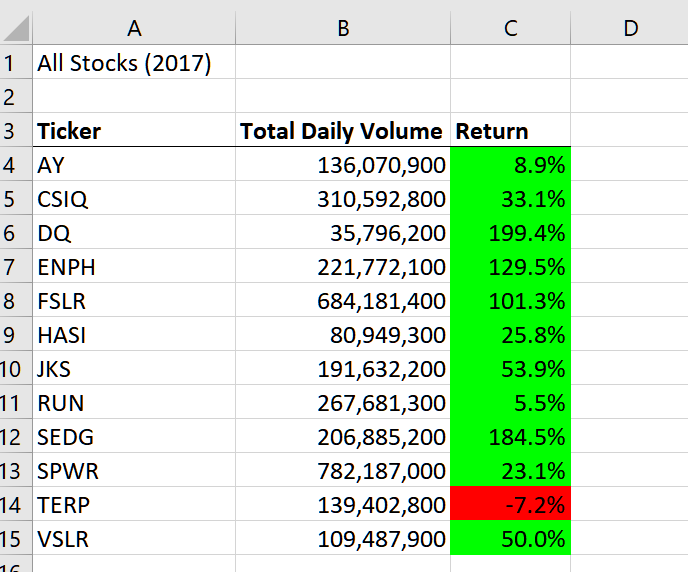
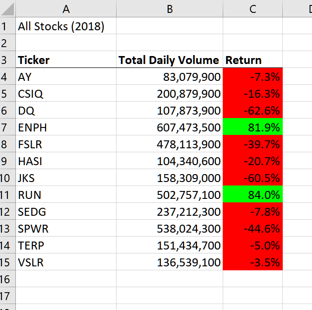
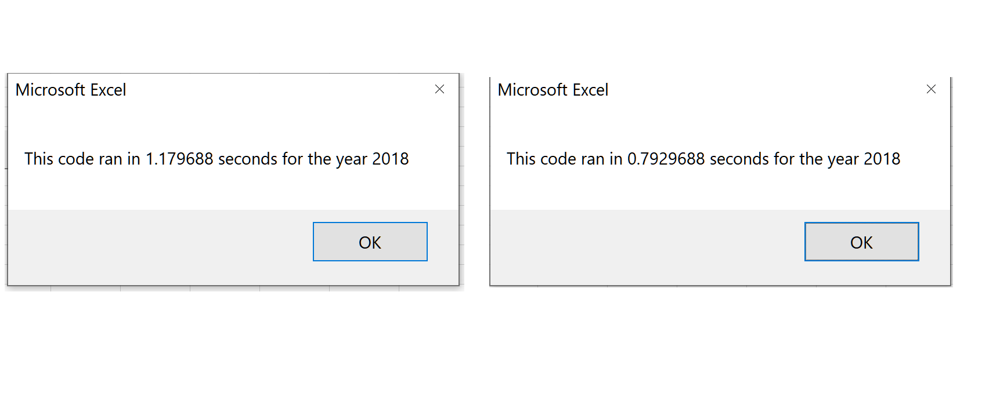

# Stock-Analysis

   
## Overview of Project 
### Purpose

The purpose of this analysis was to refractore a script which analyzed the stock performance of twelve green companies. The purpose of refactoring the script was to have it run quicker and more efficient. This work was done for Steve and his first clients, his parents, who made an investment in a green company.  

## Results
### Stock Performance
There is a clear contrast in stock performance between the years 2017 and 2018. From 2017 to 2018, there were only two tickers, ENPH and RUN, that resulted in a positive return, as shown below.
	

### Run Time Performance
The performance of the original script's run time for 2017 was 1.054688 seconds and the refactored script for 2017 was 0.7734375 seconds.
    

The performance of the original script's run time for 2018 was 1.179688 seconds and the refactored script for 2018 was 0.7929688 seconds.

### Summary
An advantage for refactoring code is that it improves performance while keeping the same functionality. A disadvantage of refactoring code is that it is time consuming and may result in small efficiency improvement. 

The pros in refactoring this VBA script, over all was about a 30% run time imrovement for the 2017 analysis and about a 40% improvement for the 2018 analysis. The con was to make the script faster, it required the use of arrays. This added complexity in keeping track in the array indexes while writing the code. My experience with this, was that the refratored code was less straight forward to understand compared to the original code. 
